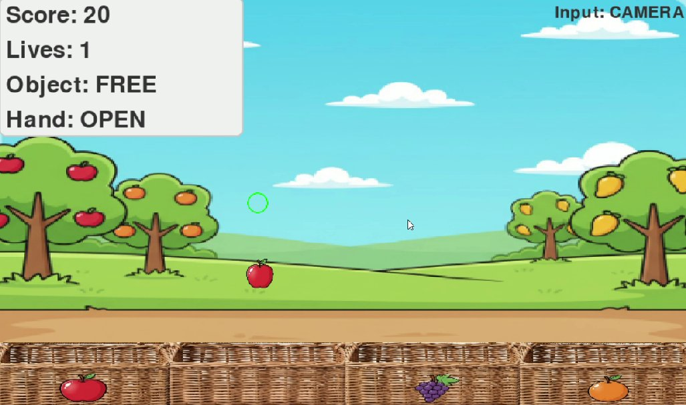
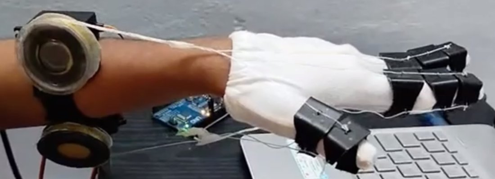
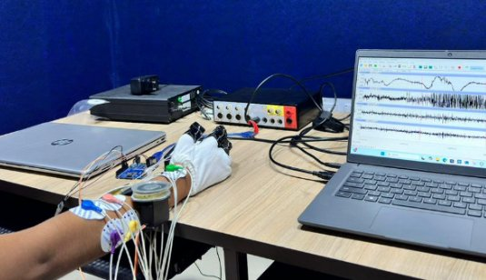
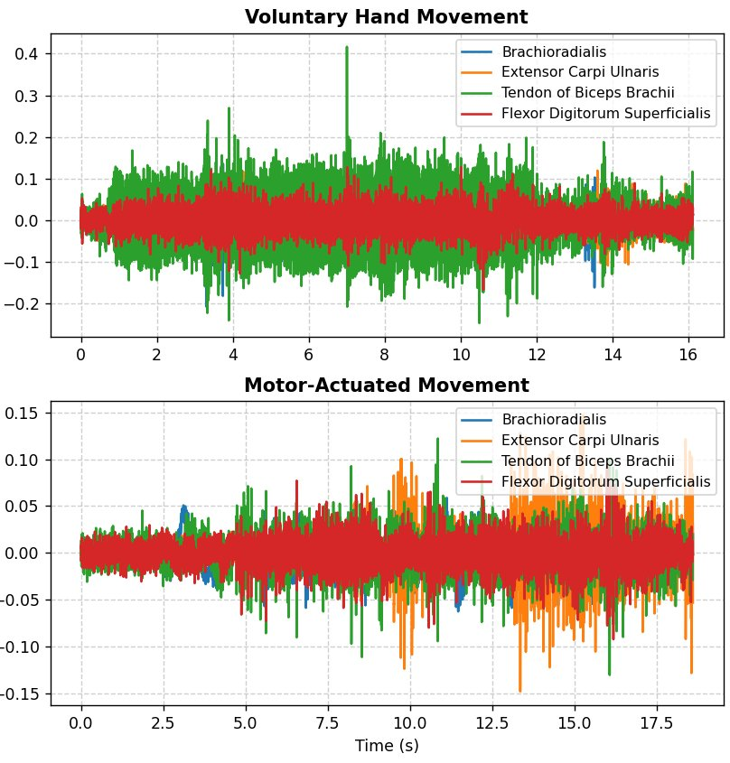
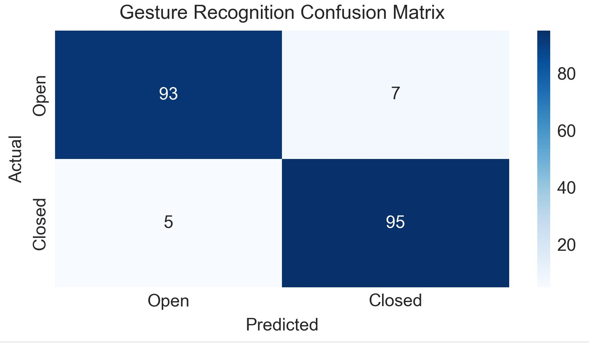

# hand_exo


> **Author:** S. Sasmitha  
> **Affiliation:** Amrita School of Artificial Intelligence, Coimbatore · Amrita Vishwa Vidyapeetham, India  
> **Paper:** *Development of an Intelligent Sorting Game with Real-Time Hand Gesture Control and MySQL Performance Analytics* — IEEE Conference, 2025

---

## What this is

A closed-loop multimodal rehabilitation platform that pairs a **vision-based serious game** with a **sensor-equipped soft robotic glove** for upper-limb motor rehabilitation. The system supports two input modes and stores every session in MySQL for longitudinal analytics.

| Mode | Hardware | How it works |
|------|----------|--------------|
| **VISION** | Microsoft LifeCam | MediaPipe 21-landmark contactless gesture recognition |
| **GLOVE**  | Arduino Uno + 5× MG996R | Tendon-driven finger actuation with haptic feedback |

Both modes drive the same PyGame sorting game. All performance data is written to MySQL after each session.

---

## Key Results (from paper)

| Metric | Value |
|--------|-------|
| Gesture recognition F1 | **92.85 %** |
| Open hand precision / recall | **94.2 % / 92.8 %** |
| Closed hand precision / recall | **91.5 % / 93.1 %** |
| Object tracking frame coverage | **95.8 %** (SD 2.8 %) |
| Tracking auto-recovery time | **1.2 ± 0.4 s** |
| End-to-end system latency | **92.0 ± 9.1 ms** |
| Mean player collection accuracy | **86.5 %** |
| Peak glove grip force | **12.4 N** |
| Finger flexion at 90° servo | **~75°** |
| Voluntary / actuated RMS ratio | **≈ 3×** |

---

## Paper Screenshots

### Game Interface


*PyGame sorting game in VISION mode — score, lives, hand state, input mode displayed in real time.*

### Robotic Glove


*Custom soft robotic glove: 5× MG996R servos, tendon-driven finger actuation, Arduino Uno, custom servo control board.*

### Experimental Setup — sEMG Acquisition


*8 differential sEMG electrodes on participant forearm connected to a multi-channel DAQ. All channels colour-coded.*

### EMG Signal Comparison


*Voluntary movement (top) vs motor-actuated movement (bottom). Mean voluntary RMS ≈ 3× actuated — confirms passive rehabilitation support.*

### Gesture Recognition Confusion Matrix


*Open: 93 correct, 7 misclassified. Closed: 95 correct, 5 misclassified. Overall F1 = 92.85 %.*

---

## System Architecture

```
┌─────────────────────────────────────────────────────────────┐
│                        INPUT LAYER                           │
│  Camera 0 — Logitech C920    → Object tracking (CSRT)       │
│  Camera 1 — MS LifeCam       → Gesture recognition          │
│  Vosk offline ASR            → Voice commands               │
│  Arduino Uno (USB serial)    → Glove mode actuation         │
└──────────────────────────┬──────────────────────────────────┘
                           │
┌──────────────────────────▼──────────────────────────────────┐
│                     PROCESSING LAYER                         │
│  MediaPipe Hands (21 3-D landmarks) — OPEN/CLOSED classify  │
│  OpenCV CSRT — object tracking + 1.2 s auto-recovery        │
│  Perspective transform — camera → screen mapping (eq. 2)    │
│  AABB collision detection — pick-up / drop logic (eq. 3)    │
└──────────────────────────┬──────────────────────────────────┘
                           │
┌──────────────────────────▼──────────────────────────────────┐
│                    GAME ENGINE LAYER                         │
│  PyGame 2.1.3 @ 60 FPS                                       │
│  State machine — spawn / grab / score / lives                │
│  Adaptive difficulty — spawn rate scales with accuracy       │
│  Multimodal feedback — visual + haptic + voice               │
└───────────────┬──────────────────────┬──────────────────────┘
                │                      │
┌───────────────▼──────┐  ┌────────────▼──────────────────────┐
│   ACTUATION LAYER    │  │      DATABASE & ANALYTICS          │
│  Arduino Uno         │  │  MySQL — players + game_sessions   │
│  5× MG996R servos    │  │  Adaptive feedback (3 tiers)       │
│  Tendon mechanism    │  │  PDF session reports               │
│  Watchdog + E-stop   │  │  Progress dashboard                │
└──────────────────────┘  └────────────────────────────────────┘
```

---

## Quick Start

### 1. Clone and setup

```bash
git clone https://github.com/sasmitha/hand_exo.git
cd hand_exo
bash setup.sh
source .venv/bin/activate
```

### 2. Try without any hardware

```bash
python main.py demo
```

### 3. Run the full game (webcam only)

```bash
python main.py calibrate          # one-time camera calibration
python main.py game --player YourName --mode VISION
```

### 4. Run with the robotic glove (Arduino required)

Upload `arduino/glove_controller/glove_controller.ino` to the Arduino Uno, then:

```bash
python main.py game --player YourName --mode GLOVE
```

### 5. MySQL setup (optional — game runs without it)

```sql
CREATE DATABASE IF NOT EXISTS rehab_db;
CREATE USER IF NOT EXISTS 'rehab_user'@'localhost' IDENTIFIED BY 'rehab_pass';
GRANT ALL PRIVILEGES ON rehab_db.* TO 'rehab_user'@'localhost';
FLUSH PRIVILEGES;
```

Tables are created automatically on first run.

### 6. All commands

```bash
python main.py demo                              # hardware-free demo
python main.py game   --player Me --mode VISION  # webcam mode
python main.py game   --player Me --mode GLOVE   # Arduino glove mode
python main.py calibrate                         # camera calibration
python main.py dashboard --player Me             # analytics dashboard
python main.py report    --player Me             # PDF session report
python main.py emg                               # EMG analysis demo
python main.py evaluate                          # reproduce Table I
```

---

## Running Tests

```bash
python -m pytest tests/ -v
# 49 passed — no hardware required
```

Tests cover gesture classification, AABB collision, scoring logic, adaptive feedback tiers, all four player accuracy values from Table III, and EMG RMS ratios.

---

## Arduino Wiring

| Servo | Finger | Arduino Pin |
|-------|--------|-------------|
| 0 | Thumb  | 3  |
| 1 | Index  | 5  |
| 2 | Middle | 5 |

Serial protocol: 9600 baud, newline-terminated.
Commands: `S<angle>`, `O` (open), `C` (close), `E` (emergency stop), `H` (heartbeat), `R` (read angles).

---

## Project Structure

```
hand_exo/
├── main.py                      # single entry point for everything
├── demo.py                      # hardware-free simulated game
├── requirements.txt
├── setup.sh
├── push_to_github.sh
│
├── src/
│   ├── config.py                # all constants matching paper
│   ├── game.py                  # PyGame engine, AABB, adaptive difficulty
│   ├── gesture_recognition.py   # MediaPipe Hands, eq. (1)
│   ├── object_tracker.py        # CSRT + perspective transform, eq. (2)
│   ├── voice_control.py         # Vosk offline ASR
│   ├── glove_controller.py      # Arduino serial interface
│   ├── database.py              # MySQL analytics, adaptive feedback
│   ├── emg_analysis.py          # sEMG processing pipeline
│   ├── analytics_dashboard.py   # Matplotlib progress charts
│   ├── session_report.py        # PDF session report (A4 landscape)
│   ├── evaluate_gestures.py     # reproduces Table I
│   └── calibration.py           # 4-point perspective calibration
│
├── arduino/
│   └── glove_controller/
│       └── glove_controller.ino # C++ firmware — servos, watchdog, E-stop
│
├── tests/
│   ├── test_gesture_recognition.py   # 18 tests
│   ├── test_database.py              # 16 tests
│   └── test_emg_analysis.py          # 15 tests
│
├── docs/
│   ├── results_viewer.html      # interactive browser dashboard (7 tabs)
│   └── schema.sql               # MySQL DDL + leaderboard view
│
└── assets/screenshots/          # all 5 paper result images
```

---

## Citation

```bibtex
@inproceedings{sasmitha2025hand_exo,
  author    = {S. Sasmitha},
  title     = {Development of an Intelligent Sorting Game with Real-Time
               Hand Gesture Control and {MySQL} Performance Analytics}
}
```

---

## License

MIT License — Copyright (c) 2025 S. Sasmitha · Amrita School of AI, Coimbatore
